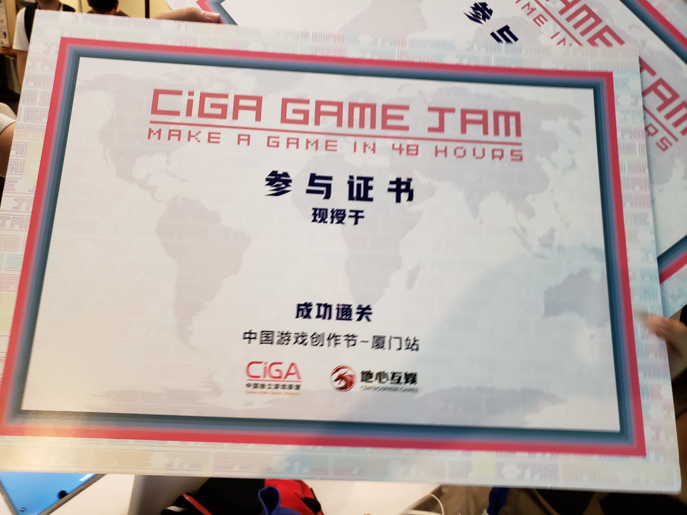
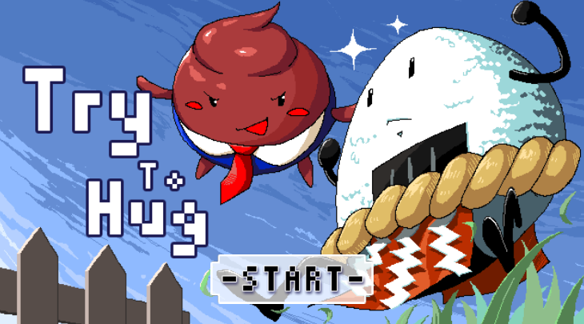
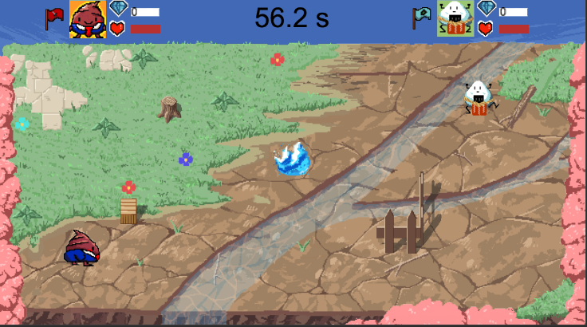
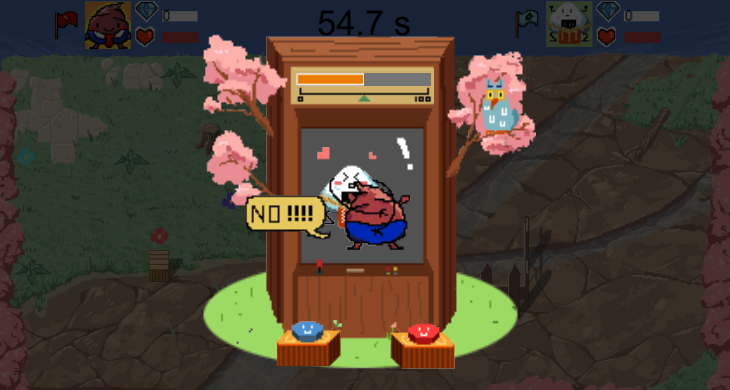

厦门CiGA GameJam 48小时游戏制作比赛的作品

队伍有我一个程序和三个半美术还有半个策划

他们都是学生，虽然我也才毕业

但是我们得了第二名

 ### 游戏玩法

两个人对战，player1 wasd移动+spce技能，player2 上下左右移动+enter技能

进攻方需要碰到防守方，技能为冲刺

防守方需要躲避防守方，技能为反弹，可以预判进攻方的冲刺

进攻方触碰到防守方后进入鬼畜敲键盘模式，各自狂按自己的技能键，根据按键次数计算本回合得分

进攻方本轮得分=进攻方敲击键盘数x2 - 防守方敲击键盘数x1

每回合1分钟，时间到攻守交替，两轮结束后计算得分确定胜负

### 碎碎念

感觉程序员也很喜欢凑热闹